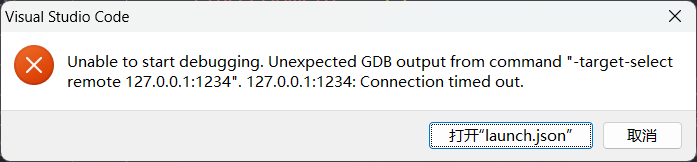

1. bear => command. json =>
		方法, bear -- make =>/home/along/ics2021/nemu/. vscode/compile_commands.json
		`痛点` , 产生之后还需要再 move 一下 (倒也不打紧)
	1. 优点: 简单快捷
	2. 缺点: 当你在项目中添加了新的文件后需要重新编译才能正确的配置
3. vscode
	1. https://code.visualstudio.com/docs/cpp/c-cpp-properties-schema-reference
	2. 直接修改 include 路径 (也挺好的)


## 关于 c_cpp_properties. json 

配置 vscode c_cpp_properties. json 文件使得 compile_commands. json 生效
[这是什么意思](https://shuiyuncode.github.io/2022/06/2022062501/image-20220625204426634.png)
`c_cpp_properties.json` 文件通常是用于配置 C/C++ 开发环境的 JSON 格式的配置文件，特别是用于 Visual Studio Code（VS Code）中的 C/C++ 开发。该文件用于指定项目的 C/C++ 编译器路径、头文件路径、预处理器定义等信息，以便编辑器正确地识别代码并提供智能补全、代码导航等功能。

以下是一个示例 `c_cpp_properties.json` 文件的基本结构：

```json
{
    "configurations": [
        {
            "name": "Win32",
            "includePath": [
                "${workspaceFolder}/**",
                "C:/path/to/your/includes"
            ],
            "defines": [],
            "windowsSdkVersion": "10.0.17763.0",
            "compilerPath": "C:/path/to/your/compiler",
            "cStandard": "c11",
            "cppStandard": "c++17",
            "intelliSenseMode": "msvc-x64"
        }
    ],
    "version": 4
}
```

在这个示例中，您可以看到：

- `configurations` ：这是配置数组，定义了不同配置的属性。
- `name` ：配置的名称，可以自定义。
- `includePath` ：头文件的搜索路径，其中 `${workspaceFolder}` 表示工作区文件夹。
- `defines` ：预处理器定义。
- `compilerPath` ：C/C++ 编译器的路径。
- `cStandard` 和 `cppStandard` ：分别表示 C 和 C++ 的标准版本。
- `intelliSenseMode` ：IntelliSense 模式，用于代码智能补全。

您可以根据自己的项目和开发环境进行相应的配置，以确保编辑器可以正确地分析和补全您的代码。

### 如何在 vscode 中新建 c_cpp_properties. json 
在 Visual Studio Code（VS Code）中创建 `c_cpp_properties.json` 文件，您可以按照以下步骤操作：

1. 打开您的 C/C++ 项目所在的文件夹，或者打开您想要进行 C/C++ 开发的文件夹。

2. 确保您已打开的文件夹中包含了 C/C++ 代码文件（`.c`、`.cpp` 等）。

3. 在 VS Code 中，打开命令面板。您可以通过按下 `Ctrl+Shift+P`（Windows/Linux）或 `Cmd+Shift+P`（Mac）来打开命令面板。

4. 在命令面板中，输入“C/C++: Edit Configurations（编辑配置）”，然后选择对应的命令。按下回车键或点击鼠标即可。

5. 这将会打开一个名为 `c_cpp_properties.json` 的新文件或已存在的文件（如果已存在的话）。

6. 在打开的 `c_cpp_properties.json` 文件中，您可以按照需要进行编辑和配置。您可以根据项目的具体要求，设置编译器路径、头文件路径、预处理器定义等信息。您可以在前面提到的示例中查找基本结构，然后根据您的需求进行修改。

7. 编辑完成后，保存文件即可。通常使用 `Ctrl+S`（Windows/Linux）或 `Cmd+S`（Mac）进行保存。

通过上述步骤，您就可以在 VS Code 中创建和编辑 `c_cpp_properties.json` 文件，以配置您的 C/C++ 开发环境。




## 关于 task. json
